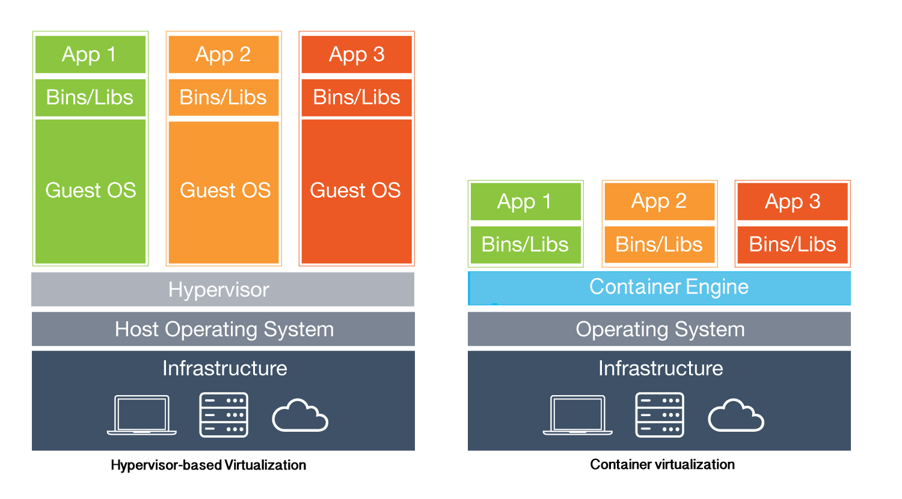
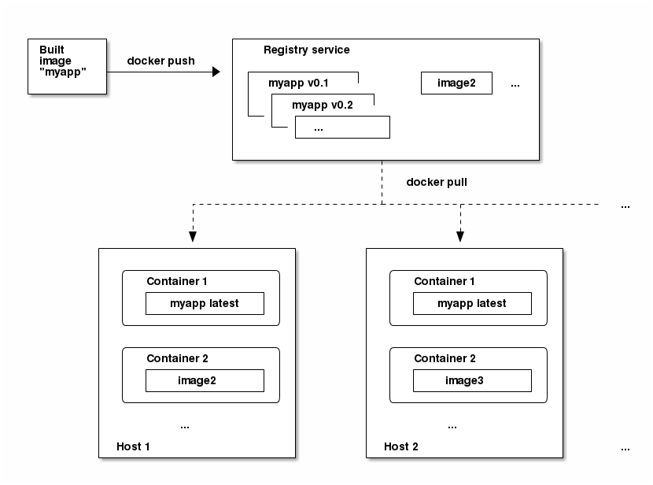
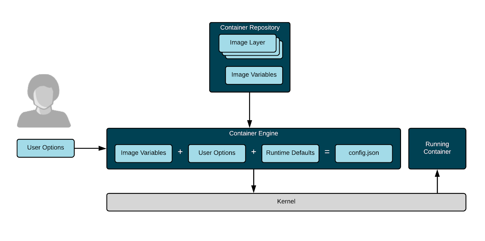
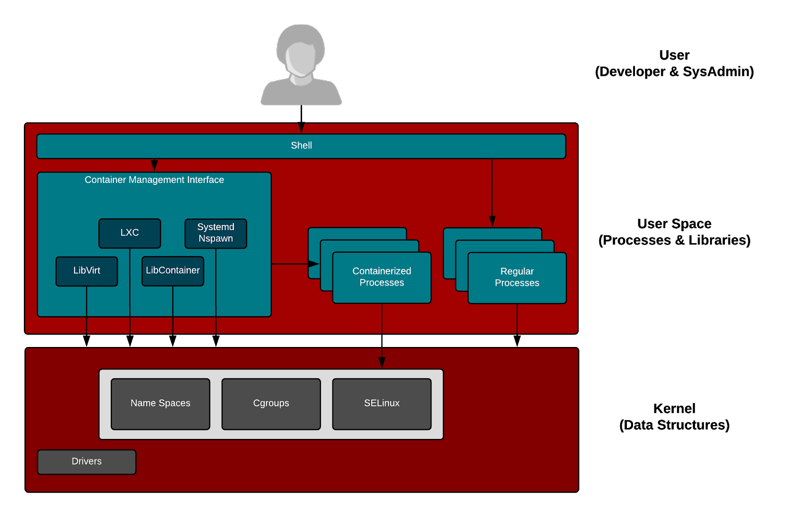
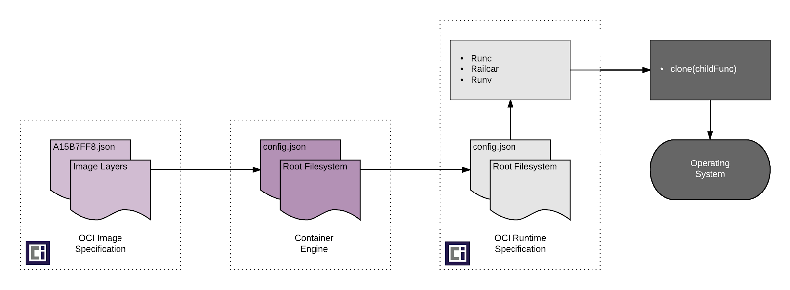
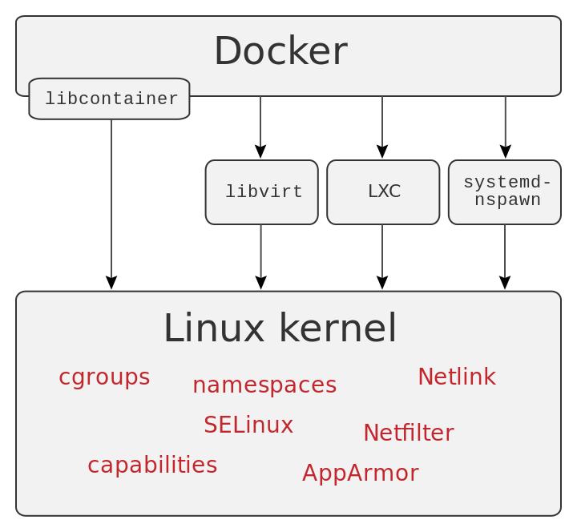
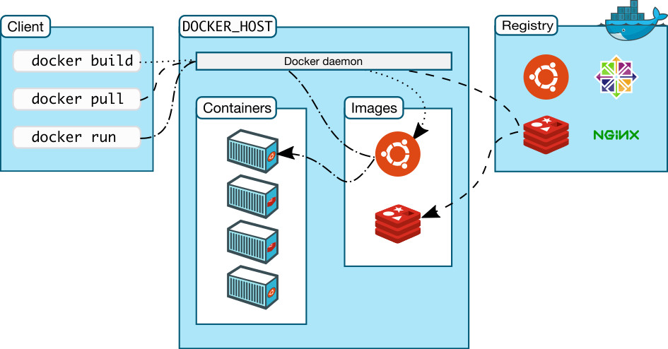

# Docker
## Konténerek
- LXC, BSD Jails, Docker
  - Chroot circa 1982,FreeBSD Jails circa 2000,Solaris Zones circa 2004, LXC circa 2008,Systemd-nspawn circa 2010-2013
  - Docker circa 2013
- Linux kernel technológiákra épülő izolált környezet
- Izolált névterek (fs, net, ps, mount, ipc,...)
- Kiforrott, gyors, biztonságos, optimális erőforrás használat


(Miben rossz ez az ábra?)

## Demo (container from scratch)
- Példa konténer létrehozásra alap linux eszköztárral: https://ericchiang.github.io/post/containers-from-scratch/
- https://opensource.com/article/18/1/history-low-level-container-runtimes

## Alapfogalmak
- Docker image: A linux root fájlrendszer módosításainak rendezett és rétegelt gyűjteménye. Nem módosítható. A futó konténerek alapja, tartalmaz minden információt, hogy egy konténer példányosítható legyen belőle.
- Docker container: Egy image futásidejű példánya, egy izolált linux process hierarchia. Alapja egy Docker image, ami kiegészül futásidejű paraméterekkel, konfigurációkkal.
- Docker registry: Image-ek gyűjtőhelye
- Dockerfile: Parancsok, utasítások gyűjteménye. Egy alap image-en futtatva sorrendhelyesen az előbbi utasításokat egy új testreszabott image áll elő.  

https://docs.docker.com/engine/reference/glossary




## OCI



## Docker architektúra



## Windows vs Linux


https://xebia.com/blog/deep-dive-into-windows-server-containers-and-docker-part-2-underlying-implementation-of-windows-server-containers/

## Rétegek
- Az image-en végzett utasítások újabb és újabb rétegeket képeznek.
- Egy image nem módosítható, a konténer példány is egy újabb rétegként jelenik meg.
- A konténer példány tartosítható, image-be menthető.


## Perzisztens tárolók
- A docker containerek nem perzisztensek, tehát leállítások esetén a tárolt adatok elvesz(het)nek
- Perzisztens tár becsatolható a konténerekbe


## Hálózat
- A konténerek hálózatot tekintve is izoláltak lehetnek a hosttól (net namespace).
- Egy konténer jellemzően egy hoston futtatott Linux Bridge-hez kapcsolódik (de számtalan féle hálózati architektúra kialakítása lehetséges).
- A konténer explicit kinyithatja a hálózati portjait (port forward).
- A konténerek összeköthetőek egymással.

## Legfontosabb parancsok
```shell
docker help                 --parancsok leírása
docker image pull           --image letöltése
docker image search         --image-ek keresése
docker container run        --konténer példány indítása
docker container run -v     --perzisztens köteg becsatolása
docker container run -it    --interaktív terminál nyitása
docker container run -d     --a konténer háttérfolyamatként futni fog
docker container run -p     --port forward
docker container ps|top     --futó konténerek
docker container inspect    --konténer futás idejű paramétereinek a lekérdezése
docker container start|stop --konténer indítása, leállítása
```

## Docker ökoszisztéma
- Docker Machine - Docker containerek futtatása virtuális gépeken
- Docker Compose - Docker container stackek kezelése
- Docker Swarm   - Docker container clusterezés

## Docker GUI management
_docker container run -d -p 9000:9000 --privileged -v/var/run/docker.sock:/var/run/docker.sock portainer/portainer_
http://localhost:9000 (passwd megadás, majd local, connect és voilá, van egy GUI a lokális docker környezet fölé)
